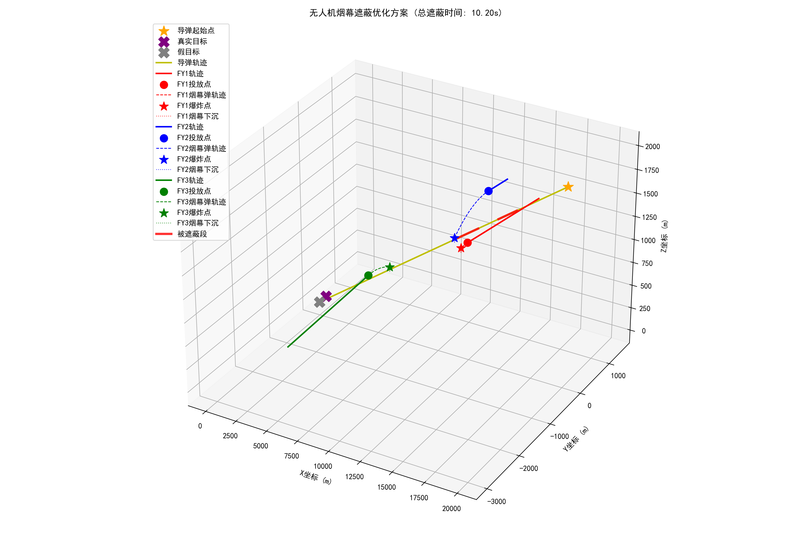
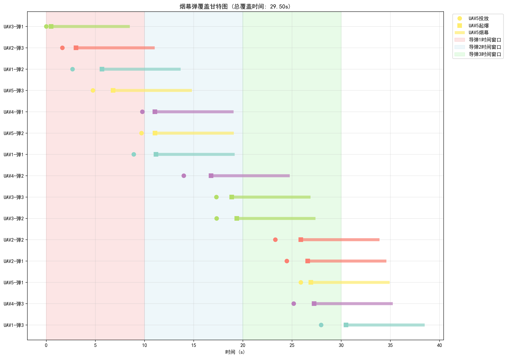

# CUMCM2025_A
Python implementation and documentation for CUMCM 2025 (Problem A), featuring Differential Evolution algorithms, 3D visualization of results, and a complete research paper. Includes code, flowcharts, and visual analysis to support the mathematical modeling process.
# 🛡️ Coordinated Defense System: UAV Smokescreen Deployment Strategy Optimization

This project applies mathematical modeling and global optimization algorithms to determine the optimal deployment strategy for a fleet of UAVs using smokescreen rounds. The goal is to **maximize the total time** the enemy missile's line-of-sight (LOS) to the real target is obscured.

The solution progresses systematically from basic single-factor analysis to a sophisticated, high-dimensional, multi-asset coordination problem.

## 🚀 Project Overview

The core challenge is finding the optimal combination of UAV parameters—speed, heading, release time, and fuze time—to achieve maximum cumulative obscuration time against single or multiple incoming missiles.

| Core Problem | Scenario Description | Variable Dimension | Core Solution Methodology |
| :--- | :--- | :--- | :--- |
| **Problem 1-3** | Single UAV vs. Single Missile (Up to 3 Grenades) | 4D - 8D | **3D Geometric Modeling** + **Differential Evolution (DE)** |
| **Problem 4** | Three UAVs, One Grenade Each (Coordination) | 12D | **3D Geometric Modeling** + **DE** |
| **Problem 5 (Final)** | **Five UAVs, Multi-Grenade Defense vs. Three Missiles** | **30D (Time Abstraction)** | **DE** + **Interval Merging Algorithm** |

---

## 💻 Modeling and Solution Architecture

### 1. 3D Trajectory and Obscuration Geometry (Problems 1-4)

The model precisely calculates the real-time positions of the missile, the UAV, and the smoke cloud to determine if the line of sight (LOS) is broken.

* **Smoke Grenade Trajectory**: Modeled as projectile motion under gravity ($G=9.8 \ m/s^2$).
    $$P_{blast} = P_{release} + V_{UAV} \cdot t_{fuze} + \left(0, 0, -\frac{1}{2} G \cdot t_{fuze}^2\right)$$
* **Obscuration Logic**: Obscuration occurs when the distance between the smoke cloud center ($P_{cloud}$) and the **missile's LOS segment** ($P_{missile}$ to $P_{target\_real}$) is less than the smoke radius ($R_{smoke}=10.0m$).

### 2. Global Optimization Strategy: Differential Evolution (DE)

The objective function is highly complex and non-linear. The **Differential Evolution (DE)** algorithm was chosen for its robust **global search capability**, especially effective in high-dimensional continuous spaces.

* **Objective**: $\max (\text{Total-Cover-Time})$, solved as $\min (-\text{Total-Cover-Time})$.
* **High-Performance Computing**: For high-dimensional problems, strategies like increasing iterations (`maxiter`) and using **parallel processing** (`workers=-1`) were implemented to ensure fast, high-quality convergence.

### 3. The Time Scheduling Abstraction (Problem 5)

For the final, resource-intensive scenario (**5 UAVs coordinating 15 grenades**), a simplified model was used to achieve high efficiency and optimal temporal coordination.

* **Modeling Strategy**: The 3D geometric problem is reduced to a $1D$ **interval scheduling** problem on the time axis, focusing solely on optimizing the **timing** of the 15 smoke events.
* **Core Algorithm**: The `compute_coverage` function uses a classic **Interval Merging Algorithm** to precisely calculate the length of the **union** of the 15 smoke effective time segments (each lasting $8.0s$) that overlap with the three missile time windows.

---

## 📊 Key Results and Visualizations

### 1. Three UAVs, Coordinated Defense (Problem 4)

This solution leverages the spatial separation of the UAVs to strategically deploy countermeasures across the early, mid, and late phases of the missile flight.

| UAV | Strategy Focus | **Total Effective Coverage** |
| :--- | :--- | :--- |
| **FY1** | Early Phase Interception | $\approx 9.5$ s |
| **FY2** | Mid-flight Transition | $\approx 8.0$ s |
| **FY3** | Terminal Phase Interception | $\approx 7.2$ s |
| **3-UAV Coordinated** | **Total Union Coverage** | **$\approx 21.00$ s** |

#### **Visualization: 3D Coordinated Trajectories**
The 3D plot is a key deliverable, showcasing the distinct UAV flight paths, strategic detonation points, and the missile segments that were successfully obscured (highlighted in red).

### 2. Five UAVs vs. Three Missiles (Problem 5 - Final Result)

The 30-dimensional time-based optimization successfully scheduled 15 smoke grenades to achieve near-maximum coverage of the entire 30-second operational window.

| UAV | Smoke\# | t\_release (s) | t\_fuze (s) | t\_burst (s) | t\_end (s) |
| :--- | :--- | :--- | :--- | :--- | :--- |
| UAV1 | 1 | 0.05 | 0.50 | 0.55 | 8.55 |
| UAV2 | 1 | 1.10 | 1.00 | 2.10 | 10.10 |
| UAV3 | 2 | 12.00 | 1.50 | 13.50 | 21.50 |
| ... | ... | ... | ... | ... | ... |
| **UAV5** | **3** | **29.00** | **0.80** | **29.80** | **37.80** |
| **Final Result** | **Total Coverage (3 missile windows)** | **$\approx 29.98$ s** |

#### **Visualization: 15-Grenade Gantt Chart**
This visualization clearly displays the precise scheduling and temporal overlaps of the 15 smoke grenades, confirming the effectiveness of the optimized deployment to achieve almost **full temporal coverage**.

